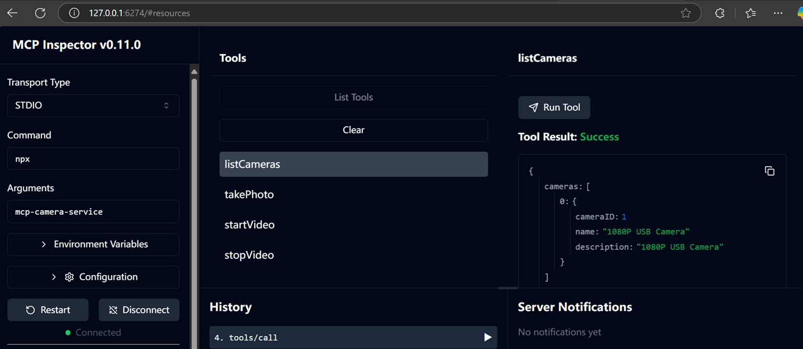

# MCP Camera Service

## 功能简介

本项目是基于 Node.js/TypeScript 的多协议摄像头控制服务，严格遵循 [Model Context Protocol (MCP)](https://github.com/modelcontextprotocol/modelcontextprotocol) TypeScript SDK，支持：
- 摄像头枚举、拍照、录像（文件/推流）等能力
- MCP 工具接口（listCameras、takePhoto、startVideo、stopVideo）
- 多种传输模式：stdio、HTTP、SSE
- 支持 Windows（dshow）和 Linux（v4l2）
- 支持多实例并发录像、推流
- 丰富的环境变量配置，日志可定制
- 录像推流支持 streamUrl，客户端可用 httpx/curl/ffmpeg/ffplay 拉流

---

## 环境依赖
- Node.js 16+
- ffmpeg（需已安装并在 PATH 或通过 ffmpeg-static 提供）
- 推荐 Windows 10+/Linux，需有摄像头设备

---

## 安装与启动

```bash
npm install
# 配置 .env 文件（见下文）
npm run build
npm start # 或 npm run start:http
```

---

## .env 配置说明
在您的本地执行时,请将.env.sample复制为.env,然后配置为您需求的参数.

```ini
# HTTP 服务端口
PORT=3001
# MCP 服务名/版本
MCP_SERVER_NAME=mcp-camera-server
MCP_SERVER_VERSION=1.0.0
# 日志等级与文件
LOG_LEVEL=info
LOG_FILEPATH=./camera.log
# 拍照/录像文件前缀与目录
PHOTO_PREFIX=image
VIDEO_PREFIX=video
PHOTO_DIR=photos
VIDEO_DIR=videos
# 录像上下文自动清理时间（秒）
FINISHED_VIDEO_CLEAN_SPAN_SECOND=1800
# 推流URL超时时间（毫秒）
STREAM_URL_EXPIRE_MS=300000
```

---

## 主要 MCP 工具接口

### 1. listCameras - 枚举摄像头
功能说明: 列出所有可用的摄像头设备

输入参数: 无

输出参数:
- cameras: 摄像头列表
  - cameraID: 摄像头编号
  - name: 设备名称
  - description: 设备描述

### 2. takePhoto - 拍照功能
功能说明: 从指定摄像头拍摄照片并保存

输入参数:
- cameraID: 摄像头编号
- filepath: 照片保存目录路径

输出参数:
- success: 操作是否成功
- imagePath: 照片保存路径(成功时返回)
- error: 错误信息(失败时返回)

### 3. startVideo - 开始录像/推流
功能说明: 启动视频录制或实时推流

输入参数:
- cameraID: 摄像头编号
- filepath: 录像文件保存路径(可选，不传则启动推流模式)
- duration: 录像时长(毫秒，可选)

输出参数(文件模式):
- success: 操作是否成功
- videoPath: 视频文件路径
- videoID: 录像会话ID

输出参数(推流模式):
- success: 操作是否成功
- videoID: 录像会话ID
- streamUrl: 推流访问地址

### 4. stopVideo - 停止录像/推流
功能说明: 停止正在进行的录像或推流

输入参数:
- videoID: 录像会话ID(startVideo返回)

输出参数:
- success: 操作是否成功
- message: 操作结果消息
- videoPath: 视频文件路径(文件模式时存在)
- error: 错误信息(失败时返回)

---

## MCP 工具接口测试方法
- 下载本仓库后,进入仓库根目录`cd myCameraNodejs`
- 使用`npm link .` 链接为全局命令
- 请通过`npx modelcontextprotocol/inspector`启动modelcontextprotocol/inspector进行测试：


  在界面中:
  - `Transport Type`: 选择`STDIO`
  - `Command`: 选择`npx`
  - `Arguments`: 输入`mcp-camera-server`

点击`Connect`按钮，即可连接到摄像头服务。
如果通过`npx run start:sse`启动服务，`URL`填入`http://127.0.0.1:3001/sse`(注意3001由.env中PORT指定)

## 视频流测试方法

### 1. 用 curl 保存为 ts 文件
```bash
curl http://localhost:3001/video/stream?videoID=xxxx-xxxx-xxxx -o output.ts
```

### 2. 用 ffplay 直接播放
```bash
ffplay http://localhost:3001/video/stream?videoID=xxxx-xxxx-xxxx
```

### 3. 用 ffmpeg 保存为 mp4 文件

#### 直接转码为 mp4（推荐）
```bash
ffmpeg -i "http://localhost:3001/video/stream?videoID=xxxx-xxxx-xxxx" -c:v libx264 -preset veryfast -crf 23 -f mp4 output.mp4
```

#### 只保存为 ts 文件（无需转码，最快）
```bash
ffmpeg -i "http://localhost:3001/video/stream?videoID=xxxx-xxxx-xxxx" -c copy output.ts
```

---

## 常见问题与排查

- **ffplay/ffmpeg 报 Invalid data found when processing input**
  - 请确认服务端推流格式为 mpegts（已修正）
- **streamUrl 只能消费一次/超时失效**
  - 设计如此，需重新调用 startVideo 获取新 streamUrl
- **摄像头找不到/拍照失败**
  - 请先用 listCameras 获取 cameraID，确保 ffmpeg 能识别
- **录像文件无法播放**
  - 建议用 ffmpeg/ffplay 转码或播放
- **推流超时时间/录像上下文清理时间**
  - 可通过 .env 配置 STREAM_URL_EXPIRE_MS、FINISHED_VIDEO_CLEAN_SPAN_SECOND

---

## 其它说明
- 支持多实例并发录像/推流
- 日志详尽，便于排查
- 支持 Windows/Linux，自动适配 dshow/v4l2
- 支持 MCP stdio/http/sse 多种模式

如有更多问题或需求，欢迎 issue 或联系Jackgao19700@qq.com。
